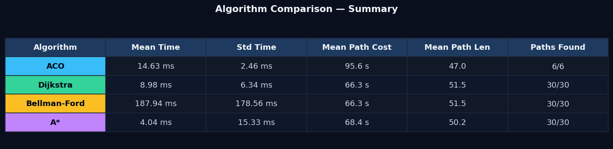

# ACO-ITS — Ant Colony Optimization for Intelligent Transportation Systems

A real-time traffic optimization and navigation system that uses **bio-inspired algorithms** (Ant Colony Optimization and Particle Swarm Optimization) to dynamically route vehicles through congested urban road networks.

Built on top of a real SUMO (Simulation of Urban Mobility) traffic simulation with ~5,000+ road edges and thousands of vehicles.



---

## Features

- **ACO-Based Route Planning** — Ant Colony Optimization finds low-congestion routes by depositing pheromones on preferred edges, adapting to real-time traffic density.
- **PSO Signal Optimization** — Particle Swarm Optimization tunes traffic signal green-phase durations to minimize waiting time at junctions.
- **Interactive Dashboard** — Full-screen canvas-based map with real-time vehicle rendering, congestion heatmaps, and turn-by-turn navigation.
- **V2V Communication Simulation** — Vehicles within communication radius share congestion alerts via toast notifications.
- **Dynamic Speed & Congestion HUD** — Speedometer, congestion gauge, and lane tracker update in real-time as the ACO vehicle navigates.
- **Historical Fallback Routing** — If ACO fails to converge, the system falls back to proven historical routes from the dataset.

---

## Project Structure

```
ACO-for-ITS/
├── run_server.py                    # Entry point — starts the FastAPI server
├── convert_trajectories.py          # Utility: converts SUMO XML → CSV
├── requirements.txt                 # Python dependencies
├── config/
│   └── settings.py                  # Hyperparameters (ACO, PSO, server, thresholds)
├── src/
│   ├── backend/
│   │   ├── api/
│   │   │   └── main.py              # FastAPI endpoints & route-planning logic
│   │   ├── core/
│   │   │   ├── traffic_engine.py    # Data loading, vehicle lookup, optimization orchestrator
│   │   │   └── driver_model.py      # Turn-by-turn instruction generator
│   │   └── optimization/
│   │       ├── aco_engine.py        # Ant Colony Optimization engine
│   │       └── pso_engine.py        # Particle Swarm Optimization engine
│   └── frontend/
│       ├── index.html               # Single-page dashboard
│       └── assets/
│           ├── css/style.css        # Dark-themed glassmorphism UI
│           └── js/app.js            # Canvas rendering, API polling, animation loop
├── data/
│   └── simulation/                  # SUMO simulation files (see Dataset Setup)
│       ├── network.net.xml          # Road network topology
│       ├── routes.rou.xml           # Vehicle route definitions
│       ├── simulation.sumocfg       # SUMO configuration
│       └── trajectories_full.csv    # Vehicle position data (~880 MB)
└── docs/
    ├── algorithm_comparison.md      # ACO vs Dijkstra vs Bellman-Ford vs A* benchmark
    ├── benchmark.py                 # Benchmark runner script
    └── figures/                     # Benchmark charts (9 PNG figures)
```

---

## Quick Start

### 1. Install Dependencies

```bash
pip install -r requirements.txt
```

### 2. Download Simulation Data

The simulation dataset (~880 MB) is hosted on Google Drive:

```bash
pip install gdown
python data/simulation/download_data.py
```

Or download manually from:  
[Google Drive → Simulation Data](https://drive.google.com/drive/folders/13Aykv4V9Rd1UEsP-ixmJH9NTULcAAC4W?usp=sharing)

Place all files in `data/simulation/`.

### 3. Start the Server

```bash
python run_server.py
```

The dashboard will be available at **http://localhost:8000**.

---

## API Endpoints

| Endpoint | Method | Description |
|----------|--------|-------------|
| `/api/meta` | GET | Network bounds and time range |
| `/api/vehicles?timestep=T` | GET | All vehicle positions at timestep T |
| `/api/edges` | GET | List of valid edge IDs for routing |
| `/api/random-trip` | GET | Random connected origin-destination pair |
| `/api/route-plan?origin=X&destination=Y&timestep=T` | GET | ACO-optimized route with instructions |
| `/api/driver-advice/{vehicle_id}?timestep=T` | GET | Turn-by-turn advice for a specific vehicle |
| `/api/network-geometry` | GET | Full road network polyline shapes |
| `/api/optimize?timestep=T` | GET | Run ACO + PSO optimization cycle |
| `/api/pheromones` | GET | Current ACO pheromone levels |
| `/api/convergence` | GET | PSO convergence history |

---

## Algorithm Details

### Ant Colony Optimization (ACO)
- **Purpose**: Route selection through congested networks
- **Mechanism**: Ants traverse the road graph probabilistically, favoring edges with high pheromone and low congestion
- **Hyperparameters**: α=1.0, β=2.0, evaporation=0.1, Q=100, 20 ants per cycle

### Particle Swarm Optimization (PSO)
- **Purpose**: Traffic signal timing optimization
- **Mechanism**: Particles represent green-phase duration configurations across junctions; the swarm minimizes total vehicle waiting time
- **Hyperparameters**: 15 particles, w=0.5, c1=c2=1.5, phase range 10–60s

See [docs/algorithm_comparison.md](docs/algorithm_comparison.md) for a detailed benchmark against Dijkstra, Bellman-Ford, and A*.

---

## Technologies

| Layer | Technology |
|-------|------------|
| Backend | Python 3.10+, FastAPI, Pandas, NumPy |
| Frontend | Vanilla HTML5, CSS3, JavaScript (Canvas API) |
| Simulation | SUMO (Simulation of Urban Mobility) |
| Algorithms | ACO (Ant Colony Optimization), PSO (Particle Swarm Optimization) |

---

## License

This project was developed as an academic minor project on bio-inspired computing for Intelligent Transportation Systems.
